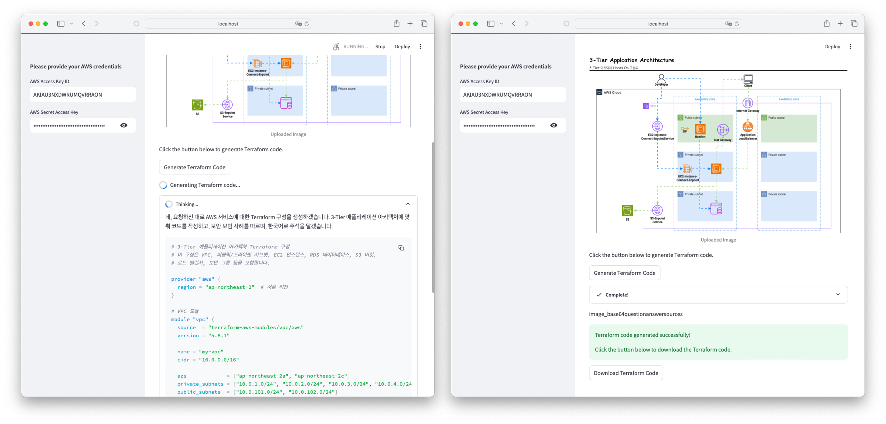
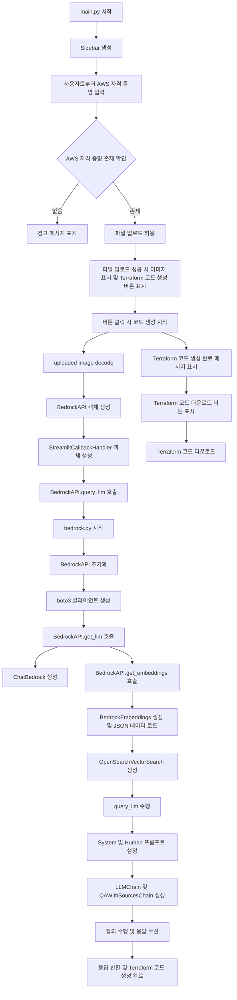

# Terraform with Gen AI

## 1. Bedrock and Open Search

테라폼(Terraform) 코드를 사용하여 Amazon OpenSearch Service 도메인을 설정하고 프로비저닝하는 방법을 설명합니다. 이 파일은 AWS, OpenSearch, Terraform에 익숙하지 않은 사용자를 위한 안내서입니다.

### 요구 사항

- Terraform 설치
- AWS 계정 및 자격 증명 설정
- AWS CLI 설치 및 구성

### 파일 구조

- `main.tf`: Terraform에서 사용할 리소스를 정의하는 파일

### Terraform 코드 설명

#### 현재 Account ID 가져오기

```hcl
data "aws_caller_identity" "current" {}
```

- 현재 AWS 계정의 ID를 가져옵니다.

#### AWS OpenSearch Service 도메인 접근 정책 설정

```hcl
data "aws_iam_policy_document" "this" {
  statement {
    effect = "Allow"
    principals {
      type        = "*"
      identifiers = ["*"]
    }
    actions   = ["es:*"]
    resources = ["arn:aws:es:${var.region}:${data.aws_caller_identity.current.account_id}:domain/${var.domain_name}/*"]
  }
}
```

- OpenSearch 도메인에 대한 접근 권한을 설정합니다.

#### Amazon OpenSearch Service 도메인 생성

```hcl
resource "aws_opensearch_domain" "rag" {
  depends_on     = [aws_secretsmanager_secret.secret]
  domain_name    = var.domain_name
  engine_version = "OpenSearch_2.13"
  ...
}
```

- OpenSearch 도메인을 생성합니다.
- 클러스터 구성, EBS 옵션, 노드 간 암호화, REST 암호화, 도메인 엔드포인트 옵션 등을 설정합니다.
- Advanced Security 옵션을 사용하여 내부 사용자 데이터베이스를 활성화하고, 마스터 사용자 이름과 비밀번호를 설정합니다.
- Access policy를 적용합니다.

#### Random Password 생성

```hcl
resource "random_password" "password" {
  length           = 16
  special          = true
  override_special = "_%@"
  min_lower        = 1
  min_numeric      = 1
  min_special      = 1
  min_upper        = 1
}
```

- OpenSearch 마스터 사용자 비밀번호로 사용할 랜덤 비밀번호를 생성합니다.

#### AWS Secrets Manager 비밀 생성 및 버전 관리

```hcl
resource "aws_secretsmanager_secret" "secret" {
  name = "opensearch-password"
}

resource "aws_secretsmanager_secret_version" "secret" {
  secret_id     = aws_secretsmanager_secret.secret.id
  secret_string = random_password.password.result
}
```

- Secrets Manager에서 OpenSearch 비밀번호를 안전하게 저장합니다.

#### OpenSearch Service nori 패키지 설치/연결

```hcl
resource "aws_opensearch_package_association" "nori" {
  domain_name = aws_opensearch_domain.rag.domain_name
  package_id  = "G225840180"
  ...
}
```

- OpenSearch 도메인에 nori 패키지를 설치하고 연결합니다.

#### OpenSearch 인덱스 생성

```hcl
resource "opensearch_index" "rag" {
  depends_on         = [aws_opensearch_domain.rag]
  name               = var.domain_name
  analysis_analyzer  = <<EOF
    {
      "my_analyzer" : {
        "char_filter" : ["html_strip"],
        "tokenizer" : "nori",
        "filter" : ["my_nori_part_of_speech"],
        "type" : "custom"
      }
    }
    EOF
  analysis_tokenizer = <<EOF
    {
      "nori" : {
        "decompound_mode" : "mixed",
        "discard_punctuation" : "true",
        "type" : "nori_tokenizer"
      }
    }
    EOF
  analysis_filter    = <<EOF
    {
      "my_nori_part_of_speech" : {
        "type" : "nori_part_of_speech",
        "stoptags" : [
          "J", "XSV", "E", "IC", "MAJ", "NNB",
          "SP", "SSC", "SSO",
          "SC", "SE", "XSN", "XSV",
          "UNA", "NA", "VCP", "VSV",
          "VX"
        ]
      }
    }
    EOF
  mappings = <<EOF
    {
      "properties": {
          "metadata": {
          "properties": {
              "source": {"type": "keyword"},
              "last_updated": {"type": "date"},
              "project": {"type": "keyword"},
              "seq_num": {"type": "long"},
              "title": {"type": "text"},
              "url": {"type": "text"}
          }
          },
          "text": {
          "analyzer": "my_analyzer",
          "search_analyzer": "my_analyzer",
          "type": "text"
          },
          "vector_field": {
          "type": "knn_vector",
          "dimension": 1024,
          "method": {
              "name": "hnsw",
              "space_type": "cosinesimil",
              "engine": "nmslib",
              "parameters": {
              "ef_construction": 512,
              "m": 16
              }
          }
          }
      }
    }
  EOF
  index_knn = true
}
```

- OpenSearch 인덱스를 생성하고 분석기, 토크나이저, 필터, 매핑 설정을 구성합니다.

### Terraform 적용 방법

1. **변수 설정**:

   - `variables.tf` 파일을 생성하여 필요한 변수를 정의합니다.

   - 예시:

    ```hcl
    # region name 설정
    variable "region" {
      description = "The AWS region to deploy to"
      type        = string
      default     = "us-east-1"
    }

    # opensearch domain name
    variable "domain_name" {
      description = "The name of the OpenSearch domain"
      type        = string
      default     = "rag"
    }
    ```

2. **Terraform 초기화**:

  ```sh
  terraform init
  ```

3. **Terraform 계획 생성**:

  ```sh
  terraform plan
  ```

4. **Terraform 적용**:

  ```sh
  terraform apply
  ```

### 주의 사항

- OpenSearch 도메인 생성 및 패키지 설치 시간은 다소 길어질 수 있습니다. `timeouts` 설정을 통해 이를 대비하였습니다.
- AWS 계정의 권한이 올바르게 설정되어 있는지 확인하십시오.
- Secrets Manager를 통해 비밀번호를 안전하게 관리하십시오.


## 2. GenAI Python 예제



### 요구 사항

- AWS 계정 및 자격 증명
- AWS CLI 설치 및 구성
- Bedrock의 모델 활성화
  - Titan Text Embeddings V2
  - Claude 3.5 Sonnet
- Python 3.8 이상 설치 (Pipfile에 명시된 버전에 따라 다름)
- 필요한 Python 패키지 설치 (Pipenv 사용)

### 파일 구조

- `main.py`: Streamlit을 사용하여 웹 애플리케이션을 실행하는 메인 파일
- `genai/bedrock.py`: AWS Bedrock과 OpenSearch를 사용하여 Terraform 코드를 생성하는 로직을 포함한 파일이며 선행 프롬프트가 명시되어 있음
- `Pipfile`: 필요한 패키지 목록과 Python 버전 요구 사항

### 주요 기능

이 애플리케이션은 사용자가 업로드한 AWS 아키텍처 이미지 파일을 기반으로 Terraform 코드를 생성합니다. AWS Bedrock과 OpenSearch 서비스를 활용하여 이미지를 분석하고, 필요한 Terraform 모듈을 식별하여 코드를 생성합니다.

### 사용된 주요 기술

#### Streamlit

Streamlit은 데이터 애플리케이션을 빠르게 구축할 수 있는 오픈 소스 파이썬 라이브러리입니다. 데이터 과학자와 엔지니어가 간단한 파이썬 스크립트를 사용하여 대화형 웹 애플리케이션을 만들 수 있도록 지원합니다.

#### AWS Bedrock

AWS Bedrock은 AI 및 머신러닝 애플리케이션을 쉽게 구축, 배포, 관리할 수 있도록 지원하는 서비스입니다. 개발자는 미리 준비된 모델과 프레임워크를 사용하여 빠르게 AI 애플리케이션을 개발할 수 있습니다. Bedrock은 머신러닝 워크플로우의 모든 단계를 관리하는 포괄적인 플랫폼을 제공합니다.

#### Amazon OpenSearch Service

Amazon OpenSearch Service는 확장 가능한 오픈 소스 검색 및 분석 엔진입니다. 로그 분석, 실시간 애플리케이션 모니터링, 검색 애플리케이션 구축 등에 사용됩니다. AWS 관리형 서비스로, 클러스터 운영, 확장, 보안 설정 등을 간편하게 관리할 수 있습니다.

### 애플리케이션 사용 방법

1. **AWS 자격 증명 설정**:
  - `main.py`를 실행하기 전에 AWS 자격 증명을 설정해야 합니다.
  - `.env` 파일에 AWS Access Key ID와 Secret Access Key를 설정하거나 Streamlit 사이드바에서 입력합니다.

2. **필요한 패키지 설치**:
  - 터미널에서 `pip install pipenv` 또는 `pip3 install pipenv`를 실행하여 필요한 패키지를 설치합니다.
  - 터미널에서 `pipenv install` 명령어를 실행하여 필요한 패키지를 설치합니다.
  - `pipenv shell` 명령어를 사용하여 가상 환경을 활성화합니다.

3. **애플리케이션 실행**:
  - 터미널에서 `streamlit run main.py` 명령어를 실행하여 애플리케이션을 시작합니다.
  - 웹 브라우저에서 로컬 호스트 주소로 접속하여 애플리케이션을 확인할 수 있습니다.

4. **AWS 아키텍처 이미지 업로드**:
  - 애플리케이션 인터페이스에서 AWS 아키텍처 이미지 파일을 업로드합니다.
  - 지원되는 파일 형식은 JPG와 PNG입니다.

5. **Terraform 코드 생성**:
  - 이미지를 업로드한 후, "Generate Terraform Code" 버튼을 클릭하여 Terraform 코드를 생성합니다.
  - 생성된 코드는 화면에 표시되며, 다운로드 버튼을 통해 `main.tf` 파일로 저장할 수 있습니다.

### 코드 설명

#### `main.py`

`main.py` 파일은 Streamlit을 사용하여 웹 애플리케이션을 실행합니다. 사이드바에서 AWS 자격 증명을 입력받고, 이미지를 업로드하여 Terraform 코드를 생성합니다.

#### `genai/bedrock.py`

`bedrock.py` 파일은 AWS Bedrock과 OpenSearch를 사용하여 이미지를 분석하고 Terraform 코드를 생성하는 로직을 포함하고 있습니다.

- `BedrockAPI` 클래스는 Bedrock 클라이언트를 초기화하고 LLM 모델과 임베딩 모델을 설정합니다.
- `query_llm` 메서드는 업로드된 이미지를 기반으로 Bedrock LLM을 사용하여 Terraform 코드를 생성합니다.

### 주의 사항

- AWS 자격 증명을 안전하게 관리하세요. `.env` 파일에 저장하거나 환경 변수를 설정하는 방법을 추천합니다.
- OpenSearch와 Bedrock 서비스는 AWS 비용이 발생할 수 있으므로, 사용 시 주의하시기 바랍니다.
- 애플리케이션 사용 중 문제가 발생할 경우, 터미널 로그를 확인하여 디버깅할 수 있습니다.

### 앱 실행/요청 플로우

